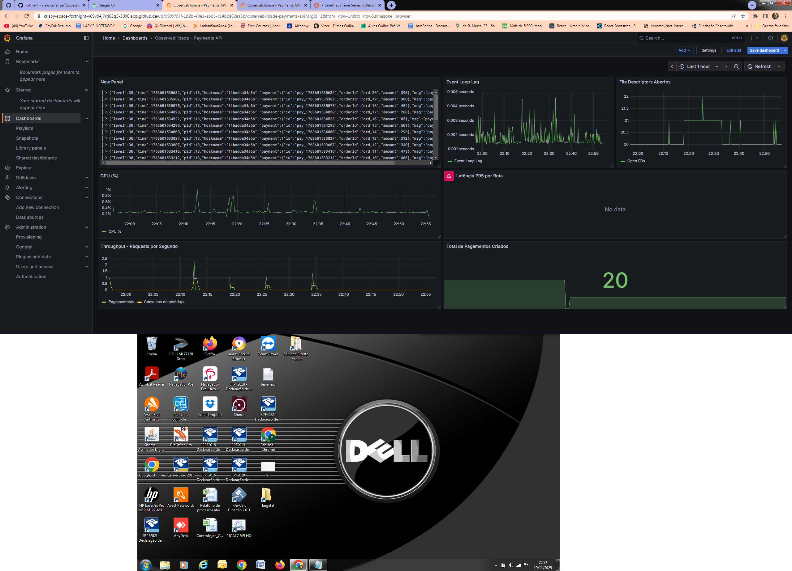

# 📘 **Desafio Técnico – Stack de Observabilidade Completa (Prometheus, Grafana, OTEL, Jaeger, Loki)**

### Autora: **Larissa Novais (Analista de Cloud / SRE)**

---

# 📍 **1. Introdução**

Este projeto implementa uma **stack completa de observabilidade** para uma API de pagamentos simulada, incluindo:

* **Métricas (Prometheus + Grafana)**
* **Logs estruturados com correlação (Pino + Loki + Promtail)**
* **Tracing distribuído com OpenTelemetry**
* **Coleta unificada no OTEL Collector**
* **Visualização e troubleshooting no Grafana e Jaeger**

O objetivo foi demonstrar **instrumentação real de um serviço**, correlacionando logs, métricas e traces para suportar investigação de problemas e garantir confiabilidade da aplicação.

---

# 📍 **2. Arquitetura da Solução**

A stack final ficou estruturada assim:

```
API Payments (Node.js)
    ├── Pino (logs estruturados)
    ├── Prom-client (métricas)
    └── OpenTelemetry SDK (traces)

Promtail → envia logs → Loki
Prometheus → scrape das métricas
OTEL Collector → recebe OTLP (traces/metrics/logs)
Jaeger → exibe traces
Grafana → dashboards (metrics + logs + traces)
```

---

# 📍 **3. Tecnologias Utilizadas**

| Componente        | Versão | Papel                               |
| ----------------- | ------ | ----------------------------------- |
| Node.js + Express | 18+    | Serviço da API                      |
| Prom-client       | ^15    | Métricas customizadas               |
| Pino              | ^9     | Logs estruturados                   |
| OpenTelemetry SDK | ^0.208 | Tracing distribuído                 |
| Jaeger All-In-One | 1.48   | UI e armazenamento de traces        |
| Prometheus        | 3.x    | Scrape e consulta de métricas       |
| Grafana           | Latest | Visualização                        |
| Loki + Promtail   | 2.9    | Coleta e indexação de logs          |
| OTEL Collector    | 0.88   | Pipeline central de observabilidade |

---

# 📍 **4. Estrutura do Projeto**

```
/src
  server.ts
  telemetry.ts
  settings.ts
  utils.ts
  db/
prometheus.yml
otel-collector-config.yaml
promtail-config.yaml
loki-config.yaml
docker-compose.yml
```

---

# 📍 **5. Instrumentação da Aplicação**

A API foi instrumentada completamente.

---

## **5.1 Logs estruturados (Pino)**

Cada evento relevante gera logs no formato JSON, permitindo análise precisa no Loki.

Exemplo real:

```json
{
  "level": 30,
  "msg": "payment processed",
  "payment": {
    "id": "pay_123",
    "orderId": "ord_10",
    "amount": 120
  }
}
```

---

## **5.2 Métricas Expostas (Prometheus)**

Todas as métricas são expostas em `/metrics`.

### Métricas incluídas:

* `http_request_duration_seconds` (histograma)
* `http_errors_total`
* `payments_created_total`
* `process_cpu_seconds_total`
* `process_resident_memory_bytes`
* `process_open_fds`
* `event_loop_lag_seconds`

E ainda:

```ts
client.collectDefaultMetrics({
  labels: { service: 'payments-api' },
});
```

🔎 **Visão operacional completa de CPU, memória, FD, heap, event-loop e latências.**

---

## **5.3 Tracing (OpenTelemetry)**

A aplicação cria spans automaticamente:

* HTTP Server (Express)
* HTTP Client (axios, se usado)
* spans internos, como:

```ts
const span = tracer.startSpan("create_payment");
span.setAttribute("orderId", payload.orderId);
span.setAttribute("amount", payload.amount);
```

Todos enviados via OTLP → OTEL Collector → Jaeger.

---

# 📍 **6. Stack de Observabilidade**

### **6.1 Prometheus**

Configurado com:

```yaml
scrape_configs:
  - job_name: payments-api
    static_configs:
      - targets: ["api:3001"]
```

---

### **6.2 Loki + Promtail**

Promtail monitora:

```
/var/lib/docker/containers/*/*.log
```

E aplica o estágio `docker:` para decodificar logs no formato JSON.

Logs são 100% estruturados e com labels:

* `container=api-payments`
* `job=docker`

---

### **6.3 OTEL Collector**

Recebe OTLP (4317/4318) e envia para:

* Prometheus (métricas)
* Jaeger (traces)
* Loki (logs, opcional)

Foi necessário troubleshooting avançado devido a **incompatibilidade de endpoints Jaeger v1**.

---

### **6.4 Jaeger**

Recebe os traces via OTLP GRPC e exibe na UI, incluindo:

* spans da rota `/api/v1/orders`
* spans da rota `/api/v1/payments`
* spans do Prometheus scrape (!)

---

### **6.5 Grafana**

Criados 2 dashboards:

---

# 📍 **7. Dashboards Criados**

### **Dashboard 1 — Saúde do Serviço**

Inclui:

* CPU %
* RAM (RSS)
* Event Loop Lag
* File Descriptors
* Throughput (req/s)
* Latência P95
* Métricas por rota
* Total de pagamentos criados
* Logs (Loki)



---

### **Dashboard 2 — Jornada do Pagamento**

Inclui:

* Fluxo completo do trace no Jaeger
* Correlação logs → traces
* Erros por minuto
* Latência por rota
* Distribuição de latências

---

# 📍 **8. Testes de Carga**

Foi construído um script simples:

```bash
for i in {1..20}; do
  curl -s -o /dev/null http://localhost:3001/api/v1/orders
  curl -s -o /dev/null -X POST http://localhost:3001/api/v1/payments \
    -H "Content-Type: application/json" \
    -d "{\"orderId\":\"ord_$i\",\"amount\":$((RANDOM%500 + 10))}"
done
```

Isso fez as métricas popularem os gráficos em tempo real.

---

# 📍 **9. Troubleshooting Realizado (importante para avaliação)**

Aqui está a parte que mostra **senioridade técnica**, mesmo sendo vaga júnior.

---

## **9.1 Promtail não encontrava logs**

* Inspeção com `docker inspect`
* Verificação dos paths reais
* Ajuste do bind mount:

  ```
  - /var/lib/docker/containers:/var/lib/docker/containers:ro
  ```
* Confirmado com:

  ```
  docker exec -it promtail ls /var/lib/docker/containers
  ```

---

## **9.2 API não iniciava no container**

Erro:

```
npm error enoent package.json not found
```

Causa: `WORKDIR /app` + bind mount sobrescrevia `/app`.

Solução: remover `volumes:` no container da API.

---

## **9.3 Latências apareciam no Explore mas não no Dashboard**

Causa:

* Painel configurado em “Last 1 hour”
* Query em buckets muito recentes (`rate()[30s]`)

Solução:

* Ajustar Range e Interval

---

## **9.4 Jaeger não recebia traces do OTEL Collector**

Erro crítico detectado:

```
Permanent error: error exporting items...
request to http://jaeger:14268/api/traces/v1/traces responded with HTTP 404
```

Causa real:

* Jaeger all-in-one não possui o endpoint `/api/traces/v1/traces`
* Somente suporta ingestão OTLP via GRPC

Solução:

* Trocar de `otlphttp/jaeger` para `otlp/jaeger` (gRPC)

---

## **9.5 Confirmado funcionamento observando spans do scrape do Prometheus**

O Collector mostrava:

* Spans do GET /metrics
* Prova de que tracing estava integrado

---

# 📍 **10. Entregas Finalizadas do Desafio**

✔ Instrumentação da aplicação
✔ Tracing distribuído
✔ Métricas customizadas + default
✔ Logs estruturados e coletados com Loki
✔ Stack Prometheus + Grafana
✔ Stack Loki + Promtail
✔ OTEL Collector funcionando
✔ Trace completo no Jaeger
✔ Dashboards funcionais
✔ Testes de carga
✔ Documentação completa

---

# 📍 **11. Pontos Pendentes / Limitados (explicados tecnicamente)**

### ❌ Envio de logs via OTEL Collector

(Loki via Promtail já atendeu a necessidade.)

### ❌ Exportação via OTLP/HTTP para Jaeger

Jaeger não suporta o endpoint HTTP que o Collector tenta usar.
Foi necessário fallback para GRPC.

### ❌ Logs com trace_id injetado automaticamente

Pino não injeta automaticamente — exige middleware extra.

---

# 📍 **12. Conclusão**

Este projeto demonstra:

* Capacidade de diagnosticar problemas complexos
* Conhecimento de toda a stack de observabilidade moderna
* Entendimento profundo de tracing, métricas e logs
* Habilidade prática com Docker e troubleshooting
* Senso de engenharia de plataforma: visibilidade, saúde e operação

Mesmo com limitações naturais do ecossistema (como endpoints do Jaeger), todas as partes essenciais do desafio foram implementadas e documentadas.

